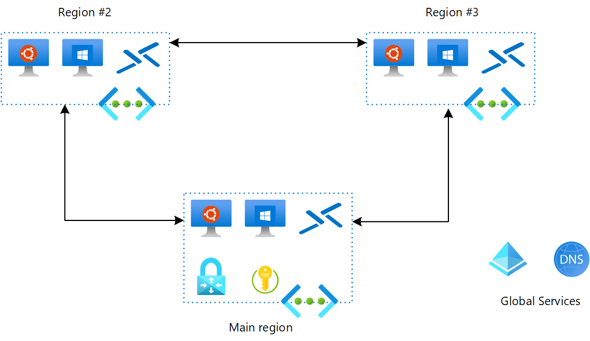
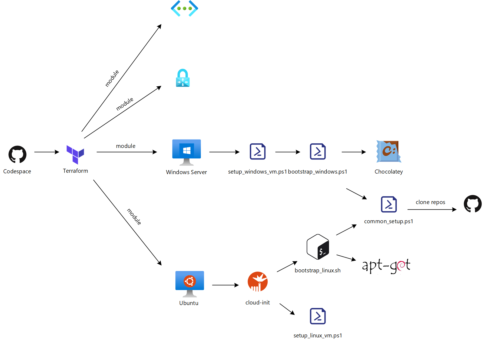

# Development Environment on Azure

This repo provides a personal Azure foundation with tooled Linux & Windows virtual machines that can be used for development, while providing private and global networking to be able to test scenario's that require it e.g. my [private AKS](https://github.com/geekzter/azure-aks) repo.   

To tailor to the individual developer, it uses low(er) cost components and takes other measures to minimize Azure consumption:
- Burstable VM type (B Series)
- Auto shutdown of VM's
- Optional components (e.g. VPN Gateway)
- NAT Gateway instead of Azure Firewall (for egress)

Most importantly, this repo provides the automation to create the infrastructure on demand. This reduces consumption to zero when you don't need it. To compensate for the incovenience of having to prepare VM's from within the host0, the bootstrap process is fully automated e.g. using my [bootstrap](https://github.com/geekzter/bootstrap-os) repo (see [setup](#setup) section below).

_Disclaimer_: this project makes different trade offs between cost, convenience & security than is typical in Enterprise developer enablement. It is intended for personal use e.g. to be used in an Azure Visual Studio subscription.

## Networking 
The network setup uses a private network that can be accessed in a number of ways (see [remote access](#remote-access) section below), outbound access is provided through [NAT Gateway](https://docs.microsoft.com/en-us/azure/virtual-network/nat-overview). The Virtual Network Gateway (required for VPN) is optional, and not deployed by default.

### Global Mesh Network
To be able to test global connectivity scenario's or use the closest Azure region when traveling, you can specify multiple regions for deployment. A full mesh will be created between the regions using global VNet peering:

Some components that need to be provisioned only once are created in the first specified region only. You can add/remove regions by (un)specifying them and re-running Terraform (see [customization](#terraform-customization) section below).

### Remote Access
While the easiest access to a VM is over a its public IP address, this is not the safest. The following options are available to access your VM's more safely:

#### Bastion
[Azure Bastion](https://azure.microsoft.com/en-us/services/azure-bastion/) is the Azure native service to provide remote access. It is provisioned as part of this repo, and provides web based RDP & SSH access.
#### Just-in-time access
If you have [Azure Security Center](https://azure.microsoft.com/en-us/services/security-center/) enabled on your subscription, you can configure a Security Center enabled Log Analytics workspace using the `log_analytics_workspace_id` Terraform input variable (see [customization](#terraform-customization) section below). This will trigger provisioning of the Log Analytics extension required for Security Center. [Just-in-Time access](https://docs.microsoft.com/en-us/azure/security-center/security-center-just-in-time) (as it name implies), opens up SSH or RDP ports only when you need them. Once Security Center is enabled and Log Analytics extension is installed, follow the instructions on the Connect dialog on the VM:

#### VPN Profiles
[Azure Point to Site VPN](https://docs.microsoft.com/en-us/azure/vpn-gateway/point-to-site-about) provides access from your laptop or desktop to an Azure Virtual Network. When accessing services that are resolved using [Private DNS](https://docs.microsoft.com/en-us/azure/dns/private-dns-overview), DNS forwarding infrastructure is required in order to be able to resolve locally on the VPN client. Azure Firewall provides this capability, but is not a cost effective solution for a single developer. Hence, this uses the [dnsmasq](http://www.thekelleys.org.uk/dnsmasq/doc.html) DNS Proxy which is installed on the Ubuntu VM and configured to forward to Azure (Private) DNS server 168.63.129.16.
To get the VPN client with this DNS forwarder configured, run [setup_vpn.ps1](scripts/setup_vpn.ps1). On Windows, this script can configure the [Azure VPN client](https://www.microsoft.com/en-us/p/azure-vpn-client/9np355qt2sqb?activetab=pivot:overviewtab). On MacOS, the required certificates are generated, but [manual configuration](https://docs.microsoft.com/en-us/azure/vpn-gateway/point-to-site-vpn-client-configuration-azure-cert#installmac) is required.

#### Let me in!
If you're desperate (you don't have Sceurity Center and time to configure VPN), but can't live with the web based Azure Bastion UI, there is a script called [let_me_in.ps1](scripts/let_me_in.ps1) that will open up SSH & RDP ports for the public IP prefix (to cater for dynamic IP addresses) that created the infrastructure using Terraform.

_Disclaimer_: use at your own risk, you are responsible to close ports again.

#### RDP files
Terraform generates RDP connection files for both private and public IP address in the [data](data/) directory.

## Setup

### Pre-requisites
#### Codespace
The easiest method is to use a GitHub [Codespace](https://github.com/features/codespaces) (in beta). Just create a GitHub Codespace from the Code menu. This will create a Codespace with pre-requizites installed. 
#### Local setup
If you set this up locally, make sure you have the following pre-requisites:
- [Azure CLI](http://aka.ms/azure-cli)
- [PowerShell](https://github.com/PowerShell/PowerShell#get-powershell)
- [Terraform](https://www.terraform.io/downloads.html) (to get that you can use [tfenv](https://github.com/tfutils/tfenv) on Linux & macOS, [Homebrew](https://github.com/hashicorp/homebrew-tap) on macOS or [chocolatey](https://chocolatey.org/packages/terraform) on Windows).

On macOS, you can run `brew bundle` to install the pre-requisites.
#### Provision
Once you have the pre-requisites set up, you can go ahead and provision infrastructure:
- Use Azure CLI for SSO with [Terraform](https://registry.terraform.io/providers/hashicorp/azurerm/latest/docs/guides/azure_cli): `az login`
- Select subscription to use: `az account set --subscription 00000000-0000-0000-0000-000000000000` (you can also set the `ARM_SUBSCRIPTION_ID` environment variable)
- Initialize terraform: `terraform init`
- Provision cloud infrastructure: `terraform apply`

### Terraform customization
You can customize the deployment by overriding defaults for Terraform [input variables](https://www.terraform.io/docs/configuration/variables.html). The easiest way to do this is to copy [config.auto.tfvars.sample](./terraform/config.auto.tfvars.sample) and save it as config.auto.tfvars.
- Set `linux_os_version` & `windows_os_version` to pin the respective OS versions and prevent recreation of VM's whenever there is a minor OS update
- Deploy point to site VPN by setting `deploy_vpn` to `true`
- Do you need environment variables set up for your VM's? Define those via the `environment_variables` map.
- Larger VM's can be defined by overriding `linux_size` and `windows_vm_size`
- If you're primarily use VPN and not the VM's itself, be aware the Linux VM runs dnsmasq which is required to resolve Private DNS. To disable shutdown, set `linux_shutdown_time` to null or an empty string.

See [variables.tf](./terraform/variables.tf) for all input variables.

### Bootstrap customization
The process to prepare the VM's and install tools is tailored to my own preferences. The diagram below describes the moving parts:

To customize this you can:
- Fork this repo and modify the bootstrap process
- Clone [bootstrap](https://github.com/geekzter/bootstrap-os) and modify which packages are installed
- Use some other process (I'm interested to learn how this can be improved)